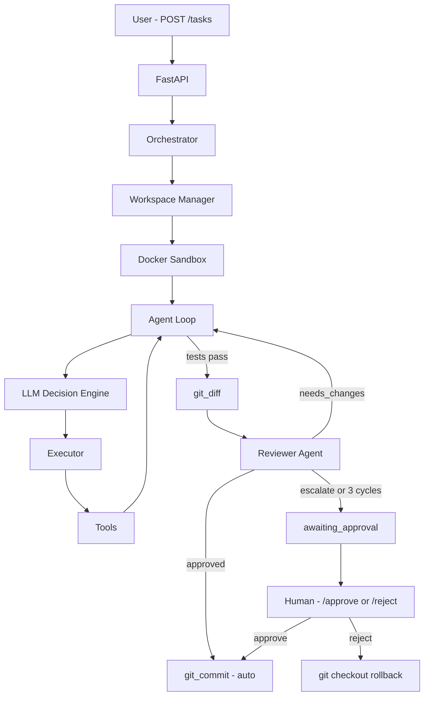
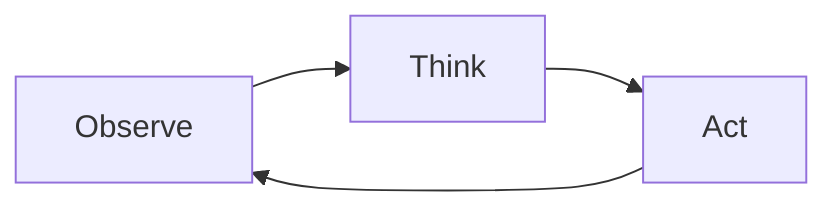

# AI Coding Orchestrator

An autonomous coding agent framework — similar in spirit to Devin or Cursor — built around a real execution loop, Docker sandboxing, and LLM-driven tool use.

This is **v0.5**: Full multi-agent pipeline with autonomous code review, human escalation gate, Docker sandboxing, and a React dashboard UI. Phases 1–5 complete.

---

## What it does

You submit a task via API. The agent takes it from there:

1. Receives the task goal
2. Asks an LLM what to do next
3. Executes a tool inside a Docker sandbox
4. Observes the result
5. Updates its memory
6. Repeats until done (or hits the iteration limit)

It's the same basic loop most serious agent systems use.

---

## Architecture



---

## Features

### Task API

Submit tasks over HTTP:

```http
POST /tasks
{
  "goal": "run tests"
}
```

Agent execution runs in a background task so the API stays responsive.

### Docker Sandbox

Each task gets its own container (`agent_ws_<task_id>`), keeping execution isolated and reproducible. Commands run via `docker exec`.

### Agent Loop

The core loop lives in `agent_runtime/agent_loop.py`:



### LLM Decision Engine

Uses Groq API (llama-3.3-70b-versatile) for fast LLM decisions at 1–2 second response times.

Each step, the model gets the task goal, recent history, and available tools, then returns a structured JSON decision:

```json
{
  "tool": "run_tests",
  "input": "",
  "done": false
}
```

Malformed responses are retried automatically.

### Tool System

Tools are registered in a central registry and called dynamically based on LLM decisions. The coder agent uses filesystem, test, and git diff tools; it does **not** call `git_commit` directly — commits happen after reviewer approval (auto) or human approval.

### Reviewer Agent

After tests pass, a second LLM agent reviews the diff, full file contents, and test results before any commit happens. It returns a structured verdict:

- `approved` — auto-commits and marks task completed
- `needs_changes` — sends feedback back to the coder agent and restarts the fix loop
- `escalate_to_human` — pauses for human review with a warning flag

If the reviewer returns `needs_changes` 3 times without resolution, the task escalates automatically to the human approval gate with the full review history attached.

### Human Approval Gate

Tasks that escalate reach `awaiting_approval` status. Three endpoints handle resolution:

- `GET /tasks/{id}/diff` — returns the diff, reviewer feedback history, and escalation reason
- `POST /tasks/{id}/approve` — triggers git commit
- `POST /tasks/{id}/reject` — runs `git checkout -- .` to roll back all changes

### Memory

The agent tracks its goal, decision history, and observations. All of it gets injected into each LLM prompt so the model has context for what it's already tried.

---

## Example output

```
Step 0 | Decision: {'tool': 'run_tests'}
Result: 1 passed

Step 1 | Decision: {'done': true}
```

---

## Repo structure

```
ai-orchestrator/
├── backend/
│   └── app/
│       ├── api/
│       ├── agents/
│       ├── config/
│       ├── models/
│       ├── orchestrator/
│       ├── workspace/
│       ├── memory/
│       ├── llm/
│       ├── tools/
│       └── logging/
├── agent_runtime/
├── frontend/          ← React UI (CRA / react-scripts)
├── docs/
│   └── Phase5-React-UI-Brief.md
├── sandbox/
│   └── docker/
└── workspaces/
```

---

## Running it

**1. Install dependencies**

```bash
pip install -r backend/requirements.txt
```

**2. Build the sandbox image**

```bash
docker build -t agent-sandbox sandbox/docker
```

**3. Start the API**

```bash
cd backend
uvicorn app.main:app --reload
```

Open `http://127.0.0.1:8000/docs` and submit a task.

Set `GROQ_API_KEY` in your environment (or `.env` at the project root) for the LLM.

**4. Start the React UI (optional)**

```bash
cd frontend
npm install
npm start
```

Opens `http://localhost:3000` and talks to the API at `http://localhost:8000` (CORS enabled). Override with `REACT_APP_API_BASE` if needed. Full UI brief: `docs/Phase5-React-UI-Brief.md`.

---

## Current Tools

| Tool | Purpose | Status |
|------|---------|--------|
| `list_directory` | Browse the workspace | ✅ |
| `read_file` | Read source files | ✅ |
| `write_file` | Write fixes | ✅ |
| `run_tests` | Run pytest in container | ✅ |
| `git_diff` | Capture changes for review | ✅ |
| `git_commit` | Auto-commit after reviewer approval | ✅ |
| `reviewer_agent` | Multi-agent code review | ✅ |

The coder LLM does not invoke `git_commit` directly; the runtime runs it after reviewer approval or human approval.

---

## Known Issues

- **LLM Repetition:** The agent occasionally re-reads files or re-lists the directory before acting. A loop breaker detects repeated identical actions and forces the next logical step. Worst case observed is 9 steps on a simple fix.
- **Reviewer over-aggression:** The reviewer prompt is tuned to only flag issues directly related to the failing tests. On complex diffs it may still request changes beyond the scope of the original bug.

---

## Logging

Every run writes to `logs/last_run.log` at the project root, overwriting on each run. The log contains every agent step, tool result, reviewer verdict with iteration count, and final status. For escalated tasks it includes the full reviewer feedback history so the human has complete context before approving or rejecting.

---

## UI Dashboard

A React dashboard is included in `frontend/` for running and monitoring tasks without touching the API directly.

**Start the frontend:**

```bash
cd frontend
npm install
npm start
```

Open `http://localhost:3000`. The backend must be running on port 8000.

**What the UI does:**

- Submit tasks from the sidebar input, results auto-select and open
- Live log view — steps stream in as the agent runs, click any step to expand and see full output
- Diff tab — syntax-highlighted git diff, available after task completes or reaches approval gate
- Review tab — full reviewer feedback history with cycle counts
- Approval banner — appears on escalated tasks with approve/reject controls inline
- Summary card — rendered at the bottom of every completed log showing step count and reviewer outcome

---

## Roadmap

| Phase | Focus | Status |
|-------|-------|--------|
| Phase 1 | Core loop, Docker sandbox, tool execution | ✅ Complete |
| Phase 2 | Repo awareness — read, list, git tools | ✅ Complete |
| Phase 3 | Human approval gate, git_diff pause, rollback | ✅ Complete |
| Phase 4 | Multi-agent reviewer loop, auto-commit, escalation | ✅ Complete |
| Phase 5 | React dashboard UI | ✅ Complete |
| Phase 6 | Dynamic repo input — point agent at any repo via API | 🔜 Next |

---

## License

MIT
