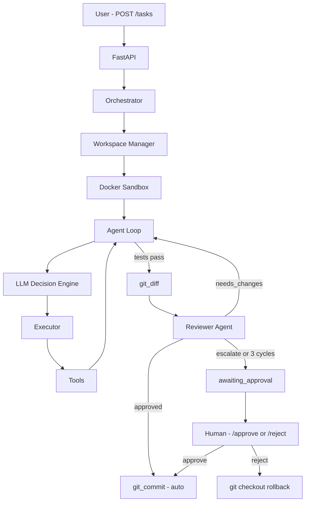
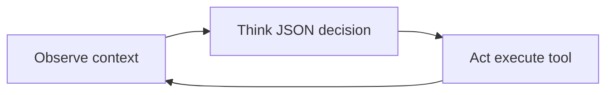

# AI Coding Orchestrator

An autonomous coding agent framework — similar in spirit to Devin or Cursor — built around a real execution loop, Docker sandboxing, and LLM-driven tool use.

This is **v0.5**: Full multi-agent pipeline with autonomous code review, human escalation gate, Docker sandboxing, and a React dashboard UI. Phases 1–5 complete.

---

## Quick Start (one-click launcher)

From the **repository root**, you can start the FastAPI backend and React dashboard together (and open the UI in your browser):

| OS | Command |
|----|---------|
| **Windows** | Double-click `start.bat`, or run `start.bat` / `python start.py` from the root folder |
| **Linux / macOS** | `chmod +x start.sh` once, then `./start.sh` or `python3 start.py` |

Requirements: Python 3 with backend dependencies installed (`pip install -r backend/requirements.txt`), Node.js/npm for `frontend`, and Docker for sandboxes. Closing the launcher console (or `Ctrl+C`) stops both the backend and frontend child processes.

Optional: build a Windows executable with [PyInstaller](https://pyinstaller.org/), for example:

```bash
pip install pyinstaller
pyinstaller --onefile --name start start.py
```

Use the generated `dist/start.exe` like `start.bat` (run from the repo root so `backend/` and `frontend/` resolve correctly).

### Kill switch (dashboard)

While a task is **running**, open it in the UI and use **Kill task** to stop that agent only. This calls `POST /tasks/{task_id}/kill`, stops the agent loop on the next step boundary, tears down that task’s Docker container (`agent_ws_<sanitized_id>`) and workspace directory, and sets status to `killed`. Telemetry logs `kill_switch_activated: user_requested`. Other tasks are unaffected; repeat calls are safe.

---

## What it does

You submit a task via API. The agent takes it from there:

1. Receives the task goal
2. Asks an LLM what to do next
3. Executes a tool inside a Docker sandbox
4. Observes the result
5. Updates its memory
6. Repeats until done (or hits the iteration limit)

It's the same basic loop most serious agent systems use.

---

## Architecture



---

## Features

### Task API

Submit tasks over HTTP:

```http
POST /tasks
{
  "goal": "run tests"
}
```

Agent execution runs in a background task so the API stays responsive.

Optional body fields (e.g. `repo_url`) are supported where the API accepts them; task state and transcripts are persisted in **SQLite** (`orchestrator.db` at the project root by default).

### Docker Sandbox

Each task gets its own container named `agent_ws_<sanitized_task_id>` (see `workspace_manager`), keeping execution isolated and reproducible. Commands run via `docker exec -i` (binary-safe stdout capture; important on Windows Docker Desktop).

### Agent Loop (Observe → Think → Act)

The core loop lives in `agent_runtime/agent_loop.py`. Each iteration is explicit:

1. **Observe** — Build context from the goal, recent tool decisions (including `reasoning`), and tool observations (stdout, structured test failure summary when present).
2. **Think** — The LLM returns a single JSON object: short `reasoning` (for logs/debug only) plus the chosen `tool`, `input`, optional `content` (for `write_file` / `apply_patch`), and `done`.
3. **Act** — The executor runs the tool in the sandbox and records the result; memory is updated for the next cycle.



### LLM Decision Engine

Uses Groq API (llama-3.3-70b-versatile) for fast LLM decisions at 1–2 second response times.

Each step, the model must return **valid JSON only** with required keys **`reasoning`**, **`tool`**, **`input`**, and **`done`** (the validator insists all four are present). Include **`content`** when using `write_file` (full file text) or `apply_patch` (unified diff); it may be omitted or `null` for other tools. The `reasoning` field is for logging only.

```json
{
  "reasoning": "Run tests to see failures before editing",
  "tool": "run_tests",
  "input": "",
  "content": null,
  "done": false
}
```

**Validation** — Before execution, the runtime checks JSON parse, presence of those keys, non-empty `reasoning`, and that `tool` is registered (when `done` is false).

**Retries** — If parsing or validation fails, the engine retries up to **2** times (3 LLM calls total), appending a correction prompt that repeats the required JSON shape. Raw responses are logged when parsing fails.

**Invalid decisions** — If all retries fail, the step is recorded as an error (invalid decision) in the replay, the task **stays running**, and the next cycle can observe the failure—no crash.

**Loop detection** — If the same `tool` and `input` run twice **consecutively**, the next Think step is forced with an override prompt. If the same `read_file(path)` appears **3 times within the last 5 steps**, that path is **blocked** from further `read_file` calls until it is modified with `apply_patch` or `write_file`, or the agent reads a different path (`loop_guard_triggered: repeated_file_read` in logs).

**Patch-first editing** — The coder is instructed to prefer **`apply_patch`** (unified diff) for small edits and **`write_file`** when the full file must be replaced.

**Test failures** — When pytest fails, `run_tests` attaches a short structured **failure summary** (failing test names and expected vs. actual when parseable from output). That summary is injected into memory so the next Observe step surfaces it before raw pytest text.

**Read behavior** — `read_file` returns full file contents (via host bind-mount or base64 in-container). Per-task **file read caching** avoids re-reading unchanged files: the executor stores content keyed by path with an `(mtime, size)` fingerprint from `stat`; cache entries are dropped after `write_file` / `apply_patch` on that path or on regression revert.

**Step budget warning** — When fewer than about **5** steps remain in the current coder phase (`MAX_AGENT_STEPS`), a warning observation is injected so the model prioritizes a concrete fix over analysis.

**Full rewrite protection** — `write_file` rejects oversized rewrites and returns actionable feedback (including `diff_ratio`) telling the agent to make a smaller localized change (preferably patch-based). Limits are size-aware: up to 40% change for normal files, up to 80% for files under 50 lines.

### Tool System

Tools are registered in a central registry and called dynamically based on LLM decisions. The coder agent uses filesystem, test, and git diff tools; it does **not** call `git_commit` directly — commits happen after reviewer approval (auto) or human approval.

### Reviewer Agent

After tests pass, a second LLM reviews the staged diff, full contents of touched files, and test output. It must return **only valid JSON** with at least:

- `verdict` — `approved` | `needs_changes` | `escalate_to_human`
- `reason` — short justification
- `confidence` — number from **0.0** to **1.0**

Optional: `suggestions` (for `needs_changes`), `lesson` (for memory on approve/escalate).

**Validation** — The runtime parses JSON and validates fields. On failure it **retries once** with a correction prompt (`reviewer_retry: invalid_json` in telemetry). If both attempts fail, it uses a deterministic fallback: `escalate_to_human` with reason `reviewer returned invalid output` and `confidence: 0`.

**Outcomes**

- `approved` — auto-commits (staged files only; see git hygiene below) and marks task completed
- `needs_changes` — feedback returns to the coder; review iteration count increases
- `escalate_to_human` — task moves to `awaiting_approval`

If the reviewer returns `needs_changes` **3** times without resolution, the task escalates to the human gate with full reviewer history.

### Human Approval Gate

Tasks that escalate reach `awaiting_approval` status. Three endpoints handle resolution:

- `GET /tasks/{id}/diff` — returns the diff, reviewer feedback history, and escalation reason
- `POST /tasks/{id}/approve` — triggers git commit
- `POST /tasks/{id}/reject` — runs `git checkout -- .` to roll back all changes

### Memory

The agent tracks its goal, decision history, and observations. All of it gets injected into each LLM prompt so the model has context for what it's already tried.

### Git hygiene (no `__pycache__` / `.pyc` in diffs or commits)

The repo root `.gitignore` includes Python bytecode and `.pytest_cache/`. Inside the sandbox, **`git_diff`** and **`git_commit`** run a staging step that **unstages** paths matching `__pycache__`, `*.pyc`, `*.pyo`, `*.pyd`, and `.pytest_cache` before producing diffs or commits, so compiled artifacts do not pollute review or history.

### Telemetry in `logs/last_run.log`

`write_last_run_log` writes a **runtime telemetry** section when present, including lines such as:

- `cache_hit: /workspace/...`
- `reviewer_retry: invalid_json` / `reviewer_fallback: invalid_output`
- `patch_applied: <path>`
- `loop_guard_triggered: repeated_file_read`
- `kill_switch_activated: user_requested`

Per-step records can also show `cache_hit`, `patch_applied`, and `loop_guard` fields when applicable.

---

## Agent Safety Mechanisms

| Mechanism | Purpose |
|-----------|---------|
| **Rewrite protection** | `write_file` compares proposed content to current file; excessive line churn (`diff_ratio`) is rejected with guidance to use smaller edits / `apply_patch`. |
| **Loop guards** | Consecutive duplicate tool+input is blocked with a forced re-decision. Repeated `read_file` on one path (3× in 5 steps) blocks further reads of that path until it is edited or another file is read. |
| **File caching** | Reduces tokens by serving cached `read_file` results when `stat` shows the file unchanged; invalidated on writes, patches, and regression revert. |
| **Reviewer validation** | Strict JSON schema + confidence; retry once, then safe fallback to human escalation. |
| **Kill switch** | User can stop a running task from the UI; the loop exits cleanly, logs the kill, and removes the sandbox. |
| **Step budget warning** | Near `MAX_AGENT_STEPS`, the model sees an explicit warning to prioritize a concrete code change. |
| **Regression guard** | If tests worsen vs. baseline after edits, the workspace is reverted via git and the coder gets a new instruction prefix. |

---

## Example output

```
Step 0 | Decision: reasoning=… | tool: run_tests
Result: 1 passed

Step 1 | Decision: reasoning=… | tool: read_file
```

---

## Repo structure

```
ai-orchestrator/
├── backend/
│   └── app/
│       ├── api/
│       ├── agents/
│       ├── config/
│       ├── models/
│       ├── orchestrator/
│       ├── workspace/
│       ├── memory/
│       ├── llm/
│       ├── tools/
│       └── logging/
├── agent_runtime/
├── frontend/          ← React UI (CRA / react-scripts)
├── docs/
│   └── Phase5-React-UI-Brief.md
├── sandbox/
│   └── docker/
├── start.py / start.bat / start.sh   ← one-click launcher
├── MEMORY.md                         ← optional agent memory (lessons)
├── orchestrator.db                   ← SQLite task store (local)
└── workspaces/                       ← per-task sandboxes (gitignored)
```

---

## Running it

**1. Install dependencies**

```bash
pip install -r backend/requirements.txt
```

**2. Build the sandbox image**

```bash
docker build -t agent-sandbox sandbox/docker
```

**3. Start the API**

```bash
cd backend
uvicorn app.main:app --reload
```

Open `http://127.0.0.1:8000/docs` and submit a task.

Set `GROQ_API_KEY` in your environment (or `.env` at the project root) for the LLM. See **`.env.example`** for optional variables (`GROQ_MODEL`, `MAX_AGENT_STEPS`, `SANDBOX_IMAGE`, `WORKSPACE_ROOT`, timeouts, etc.).

**4. Start the React UI (optional)**

```bash
cd frontend
npm install
npm start
```

Opens `http://localhost:3000` and talks to the API at `http://localhost:8000` (CORS enabled). Override with `REACT_APP_API_BASE` if needed. Full UI brief: `docs/Phase5-React-UI-Brief.md`.

---

## Current Tools

| Tool | Purpose | Status |
|------|---------|--------|
| `list_directory` | Browse the workspace | ✅ |
| `read_file` | Read source files (full content; per-task cache when unchanged on disk) | ✅ |
| `apply_patch` | Apply minimal unified-diff edits to existing files | ✅ |
| `write_file` | Write full file content (guarded against oversized rewrites) | ✅ |
| `run_tests` | Run pytest in container | ✅ |
| `run_command` | Run a shell command in the sandbox (e.g. `pip install` when tests need deps) | ✅ |
| `git_diff` | Capture staged changes for review (bytecode paths unstaged first) | ✅ |
| `git_commit` | Used by the runtime after reviewer/human approval (not chosen by the coder LLM) | ✅ |
| `reviewer_agent` | Automated review step after green tests (invoked by the runtime, not the coder tool registry) | ✅ |

The coder LLM does not invoke `git_commit` directly; the runtime runs it after reviewer approval or human approval.

Minimal edits are preferred because autonomous agents are more reliable when they operate on small, targeted changes. Smaller diffs reduce hallucinated deletions, lower regression risk, and make reviewer validation more deterministic.

---

## Known Issues

- **LLM repetition:** The agent may still re-read or re-list before acting. Mitigations: consecutive duplicate tool+input loop breaker, per-path `read_file` blocking after 3 reads in 5 steps, and file read caching to cut token cost on legitimate re-reads.
- **Reviewer over-aggression:** The reviewer prompt is scoped to the failing tests. On large or ambiguous diffs it may still request changes beyond the original bug.

---

## Logging

Every run writes to `logs/last_run.log` at the project root, overwriting on each run. The log contains every agent step, tool result, reviewer verdict with iteration count, and final status. For escalated tasks it includes the full reviewer feedback history so the human has complete context before approving or rejecting.

---

## UI Dashboard

A React dashboard is included in `frontend/` for running and monitoring tasks without touching the API directly.

**Start the frontend:**

```bash
cd frontend
npm install
npm start
```

Open `http://localhost:3000`. The backend must be running on port 8000.

**What the UI does:**

- Submit tasks from the sidebar input, results auto-select and open
- Live log view — steps stream in as the agent runs, click any step to expand and see full output
- Diff tab — syntax-highlighted git diff, available after task completes or reaches approval gate
- Review tab — full reviewer feedback history with cycle counts
- Approval banner — appears on escalated tasks with approve/reject controls inline
- Summary card — rendered at the bottom of every completed log showing step count and reviewer outcome

---

## Roadmap

| Phase | Focus | Status |
|-------|-------|--------|
| Phase 1 | Core loop, Docker sandbox, tool execution | ✅ Complete |
| Phase 2 | Repo awareness — read, list, git tools | ✅ Complete |
| Phase 3 | Human approval gate, git_diff pause, rollback | ✅ Complete |
| Phase 4 | Multi-agent reviewer loop, auto-commit, escalation | ✅ Complete |
| Phase 5 | React dashboard UI | ✅ Complete |
| Phase 6 | Dynamic repo input — point agent at any repo via API | 🔜 Next |

---

## License

MIT
