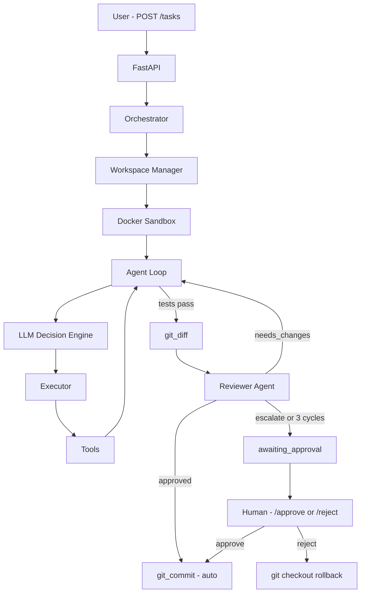

# 🔥 Vulcan Forge

**Autonomous AI coding agent** — submits a task, reads the codebase, writes targeted fixes,
runs tests, gets reviewed by a second AI agent, and commits. All inside a Docker sandbox.


## Demo

> *Clean run — 9 steps, 4 bugs fixed, 23/23 tests passing, reviewer approved at 0.95 confidence*

[demo video or GIF here]

*Submit a task → agent reads → writes targeted fix → tests pass → reviewer approves → auto-commits*

## How it works

1. You submit a task goal and (optionally) a GitHub repo URL
2. Agent inspects the workspace and runs the test suite to find failures
3. LLM reads relevant files and writes a targeted fix
4. Tests run automatically after every write — no manual step
5. A second **Reviewer Agent** reads the diff and either approves, requests changes, or escalates
6. On approval → auto-commits. On escalation → human approval gate with diff view
7. All execution happens inside a **Docker sandbox** (network-isolated, memory/CPU limited)
8. Full trace, diff, and review history available in the dashboard

## Architecture



## Features

| Feature | Detail |
|---------|--------|
| **Multi-agent pipeline** | Coder agent + independent Reviewer agent with structured JSON verdicts |
| **Docker sandbox** | Network-isolated (`--network none`), memory/CPU limited, per-task containers |
| **Human approval gate** | Tasks escalate to human review with full diff — approve to commit, reject to rollback |
| **Regression guard** | If edits worsen test results, workspace auto-reverts via git |
| **Token compression** | Observation condensing, caveman compression on reasoning, structured test output |
| **Loop detection** | Blocks consecutive reads, idle list loops, no-op writes, and full rewrites |
| **Live dashboard** | React UI with TRACE/DIFF/REVIEW tabs, token counter, slash commands |
| **SSE streaming** | Real-time step updates via Server-Sent Events with polling fallback |
| **SQLite persistence** | Tasks survive server restarts; history loads on startup |
| **Slash commands** | `/approve` `/reject` `/stop` `/retry` `/status` from the command bar |

## Stack

| Layer | Technology |
|-------|-----------|
| Backend | FastAPI, Python 3.11, Pydantic |
| LLM | Groq API — `llama-3.3-70b-versatile` |
| Sandbox | Docker (`--network none`, `--memory 512m`, `--cpus 1.0`) |
| Frontend | React 18, Geist Mono, DM Serif Display |
| Persistence | SQLite |
| Agent tools | `list_directory` `read_file` `write_file` `run_tests` `git_diff` `git_commit` `run_command` |

## Quick Start

**Requirements:** Python 3.11+, Node.js 18+, Docker

**1. Clone and install** — fetch the repo and install backend dependencies.

```bash
git clone https://github.com/riverdoggo/vulcan-forge
cd vulcan-forge
pip install -r backend/requirements.txt
```

**2. Set your API key** — copy the example env file and add your Groq key (see `.env.example` for optional variables such as `GROQ_MODEL`, `MAX_AGENT_STEPS`, `SANDBOX_IMAGE`, `WORKSPACE_ROOT`, and timeouts).

```bash
cp .env.example .env
# Add your GROQ_API_KEY to .env
```

**3. Build the sandbox image** — produce the `agent-sandbox` image the orchestrator uses for tool runs.

```bash
docker build -t agent-sandbox sandbox/docker
```

**4. Start everything** — launch the FastAPI backend and React app together from the repo root (closing the launcher or `Ctrl+C` stops both processes).

| OS | Command |
|----|---------|
| **Windows** | Double-click `start.bat`, or run `start.bat` / `python start.py` from the root folder |
| **Linux / macOS** | `chmod +x start.sh` once, then `./start.sh` or `python3 start.py` |

```bash
# Windows
start.bat

# Linux / macOS  
./start.sh
```

Dashboard opens at `http://localhost:3000` · API docs at `http://localhost:8000/docs`. The UI talks to the API on port 8000 (CORS enabled); set `REACT_APP_API_BASE` if you need a different API URL. UI behavior is summarized in `docs/Phase5-React-UI-Brief.md`.

Each run writes **`logs/last_run.log`** at the project root (overwritten each time) with every step, tool result, reviewer verdict and iteration, final status, and full reviewer history for escalated tasks.

Per-task workspaces live under `workspaces/` (gitignored). Optional agent memory / lessons: `MEMORY.md` at the repo root.

Optional: build a one-file launcher with PyInstaller (`pip install pyinstaller` then `pyinstaller --onefile --name start start.py`) and run `dist/start.exe` from the repo root on Windows so `backend/` and `frontend/` resolve correctly.

## Safety & Reliability

| Mechanism | Purpose |
|-----------|---------|
| **Rewrite protection** | `write_file` compares proposed content to current file; excessive `diff_ratio` vs a **size-based** max is rejected; identical content is rejected as a no-op. |
| **Loop guards** | Consecutive duplicate tool+input is blocked with a forced re-decision. Repeated `read_file` on one path (3× in 5 steps) blocks further reads; redundant second read of a cached path is rejected; consecutive same-path reads or list-dir stalls get an override with test context. |
| **File caching** | Reduces tokens by serving cached `read_file` results when `stat` shows the file unchanged; invalidated on writes, patches, and regression revert. |
| **Forced run_tests** | After a successful `write_file` / `apply_patch`, the next step runs `run_tests` without calling the LLM. |
| **Docker I/O** | `docker exec` uses `communicate()` with `bufsize=-1` and `-i` for full binary stdout capture. |
| **Reviewer validation** | Strict JSON schema + confidence; retry once, then safe fallback to human escalation. |
| **Kill switch** | User can stop a running task from the UI; the loop exits cleanly, logs the kill, and removes the sandbox. |
| **Step budget warning** | Near `MAX_AGENT_STEPS`, the model sees an explicit warning to prioritize a concrete code change. |
| **Regression guard** | If tests worsen vs. baseline after edits, the workspace is reverted via git and the coder gets a new instruction prefix. |

## Tools

| Tool | Purpose | Status |
|------|---------|--------|
| `list_directory` | Browse the workspace | ✅ |
| `read_file` | Read source files (full content; per-task cache when unchanged on disk) | ✅ |
| `apply_patch` | Apply minimal unified-diff edits to existing files | ✅ |
| `write_file` | Write full file content (guarded against oversized rewrites) | ✅ |
| `run_tests` | Run pytest in container | ✅ |
| `run_command` | Run a shell command in the sandbox (e.g. `pip install` when tests need deps) | ✅ |
| `git_diff` | Capture staged changes for review (bytecode paths unstaged first) | ✅ |
| `git_commit` | Used by the runtime after reviewer/human approval (not chosen by the coder LLM) | ✅ |
| `reviewer_agent` | Automated review step after green tests (invoked by the runtime, not the coder tool registry) | ✅ |

The coder LLM does not invoke `git_commit` directly; the runtime runs it after reviewer approval or human approval.

Minimal edits are preferred because autonomous agents are more reliable when they operate on small, targeted changes. Smaller diffs reduce hallucinated deletions, lower regression risk, and make reviewer validation more deterministic.

## Roadmap

| Phase | Focus | Status |
|-------|-------|--------|
| Phase 1 | Core loop, Docker sandbox, tool execution | ✅ Complete |
| Phase 2 | Repo awareness — read, list, git tools | ✅ Complete |
| Phase 3 | Human approval gate, git_diff pause, rollback | ✅ Complete |
| Phase 4 | Multi-agent reviewer loop, auto-commit, escalation | ✅ Complete |
| Phase 5 | React dashboard UI (initial) | ✅ Complete |
| Phase 6 | Dynamic repo input — `repo_url` on `POST /tasks`, GitHub clone / local copy / default workspace | ✅ Complete |
| Phase 7 | Vulcan Forge dashboard — branding, TRACE/DIFF/REVIEW, command bar, live token display, summary token stats, auto history load | ✅ Complete |
| Phase 8 | Token efficiency — observation condensing, `<latest_read_file>` dedupe, `run_tests` prompt truncation, skip-LLM `run_tests` after successful write | ✅ Complete |
| Phase 9 | Agent reliability — JSON extraction (string-aware braces, markdown fence strip), write-first prompts, redundant read block, idle read/list overrides + test context, no-op write rejection, size-based rewrite ratio, Docker `Popen` bufsize, successful-write-only double-write `run_tests` force | ✅ Complete |
| Phase 10 | Optional — cheap model for summarization / routing + strong model for decisions only; RAG for large repos | 🔜 Next |

## API & agent contracts

Tasks are submitted over HTTP (`POST /tasks` with `goal`; optional `repo_url`). The API runs the agent in a background task and persists state to **SQLite** (`orchestrator.db` at the project root by default). Each task gets its own container named `agent_ws_<sanitized_task_id>`; commands use `docker exec -i` for binary-safe stdout (including on Windows Docker Desktop).

This is **v1.0**: Phases **1–9** in the roadmap below are implemented; later rows are optional next steps.

### Coder decision (JSON)

Each coder step, the model returns **valid JSON only** with `reasoning`, `tool`, `input`, and `done`; include `content` for `write_file` / `apply_patch` when needed.

```json
{
  "reasoning": "Run tests to see failures before editing",
  "tool": "run_tests",
  "input": "",
  "content": null,
  "done": false
}
```

### Reviewer, human gate, and kill switch

After tests pass, the **Reviewer Agent** returns JSON with `verdict` (`approved` \| `needs_changes` \| `escalate_to_human`), `reason`, and `confidence` (0.0–1.0); optional `suggestions` and `lesson`. Invalid reviewer JSON triggers one retry, then a deterministic fallback to human escalation. If the reviewer returns `needs_changes` **three** times without resolution, the task escalates to the human gate. Outcomes: `approved` → auto-commit staged files; `needs_changes` → feedback to the coder; `escalate_to_human` → `awaiting_approval`. Humans resolve via `GET /tasks/{id}/diff`, `POST /tasks/{id}/approve`, and `POST /tasks/{id}/reject` (reject runs `git checkout -- .`). While a task is **running**, `/stop` in the dashboard command bar or `POST /tasks/{task_id}/kill` stops the loop, tears down that task’s container and workspace, and sets status to `killed` (`kill_switch_activated: user_requested` in telemetry); other tasks are unaffected.

### Git staging hygiene

Before `git_diff` and `git_commit`, the runtime **unstages** paths matching `__pycache__`, `*.pyc`, `*.pyo`, `*.pyd`, and `.pytest_cache` so bytecode and cache dirs do not enter review or history (root `.gitignore` also covers bytecode and `.pytest_cache/`).

## Current Limitations

- **Single-file focus** — multi-file changes across a repo are not yet supported
- **Dependency installation** — packages must be pre-installed in the sandbox image;
  `pip install` inside the container fails due to `--network none`
- **Rate limits** — Groq free tier caps at 100k tokens/day; complex runs use ~5-8k tokens each
- **Large repos** — file read truncation can occur on files above ~5KB (in progress)
- **LLM repetition:** Mitigations include redundant-read rejection, read-path blocking, idle-loop overrides (read/list), and prompt rules; edge cases may still occur on unusual tool sequences.
- **Reviewer scope:** The reviewer prompt is tied to failing tests; on large or ambiguous diffs it may still request changes beyond the original bug.

## License

MIT — see [LICENSE](LICENSE)
